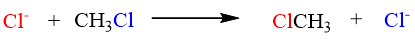
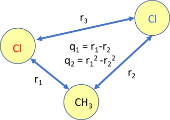

# AD_umbrella
Automatic differentiation for umbrella sampling

## Finkelstein reaction
Script to model the Finkelstein reaction using a reactive potential

Performs umbrella sampling along the r1-r2 coordinate

